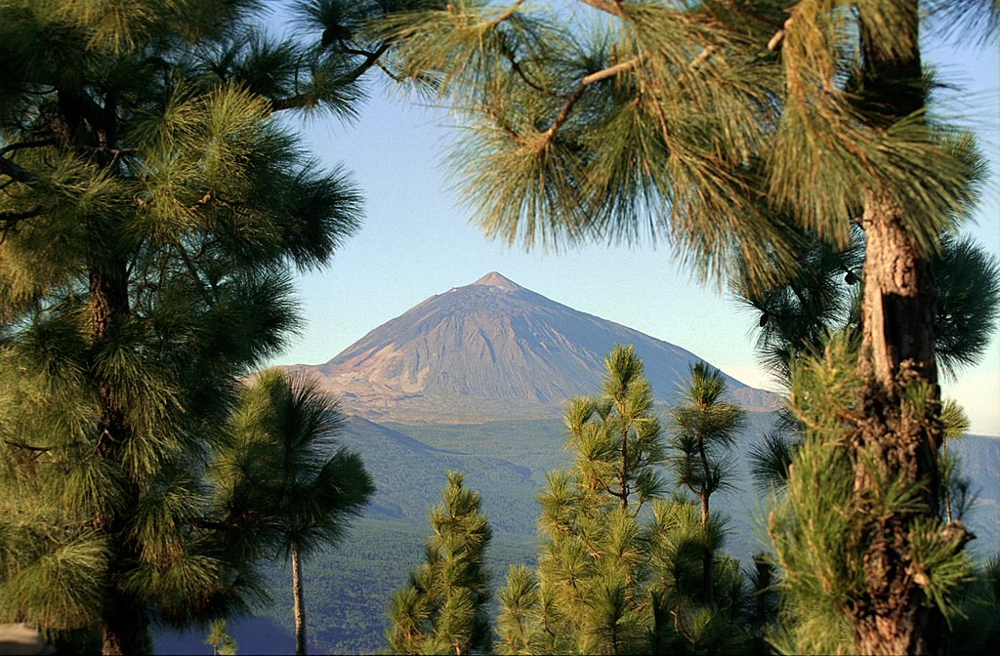

This past year I fulfilled my goal of improving my **Functional Programming** skills and, I was lucky to be selected to speak at the **["JS Day, Canarias Edition"](https://jsdaycanarias.com/) conference**.

For those who know nothing about **Canarias**, it is like the "Spanish Valhalla". An archipelago formed after volcanic eruptions, which produced one of the most beautiful places you can visit in the Earth. Don't trust me? **A picture worths a thousand words**.

The conference itself does not lag, with **one of the highest technical talk levels** I have ever seen in an event. The organization team is **pushing the limits of the event** far, and I'm thrilled to see all the effort is making its award. The ambiance was fantastic, and I enjoyed the company of many great people.

## Got invited to write an article about JS FP

I got the opportunity to write [another post as a guest](https://softwarecrafters.io/javascript/introduccion-programacion-funcional-javascript) — this time for [Software Crafters](https://softwarecrafters.io/). The article (in Spanish) is an introduction to **Functional Programming** concepts in **JavaScript**.

Given the high technical level of the blog and the fact that the author recently wrote [one of the best JS programming books in Spanish](https://leanpub.com/cleancodejavascript), it was absolutely an honor to receive the invitation.

**I hope to keep writing technical articles in this new year**, on this page, or as a guest, as there is no better way to learn than teaching others.

## Family grows

No project can compare to **the most crucial purpose in my life**, to take care of the **new member of the family** 👶, who was born in May.

I never thought I was going to **react with a smile** to the privation of sleep and changing diapers, but here I am. <q>A great power carries a great responsibility.</q>

## New web

In the last month of the year, I worked on **this new version of my website**, as the last one looked _"old-fashioned"_, and it lacked **any content or purpose**.

I decided to move out of my comfort zone and **start writing in English**, to reach a wider audience and to improve my skills. It was a hard decision, given the fact that **I have limited time**, and writing in my **native tongue is way faster**, but I decided to pay the taxes and follow my heart.

## Looking forward

My only goal for this year is finding the perfect balance between **work** and **family**. It looks like a **big challenge**, and I have no doubts it's hard, but as Hunter S. Thompson said, <q>Anything that gets your blood racing is probably worth doing.</q>

### Pictures Credits

1. Jerzy Strzelecki [CC BY 2.0](https://creativecommons.org/licenses/by/2.0)
2. Svein-Magne Tunli - tunliweb.no [CC BY 2.0](https://creativecommons.org/licenses/by/2.0)
3. Hans Bezard [CC BY 2.0](https://creativecommons.org/licenses/by/2.0)
